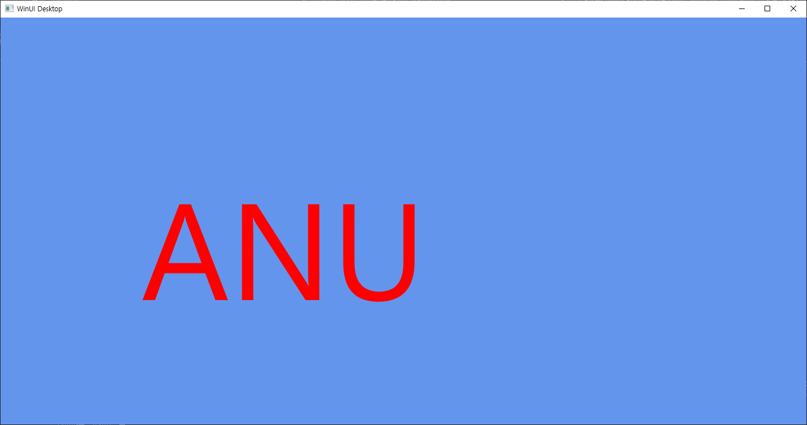
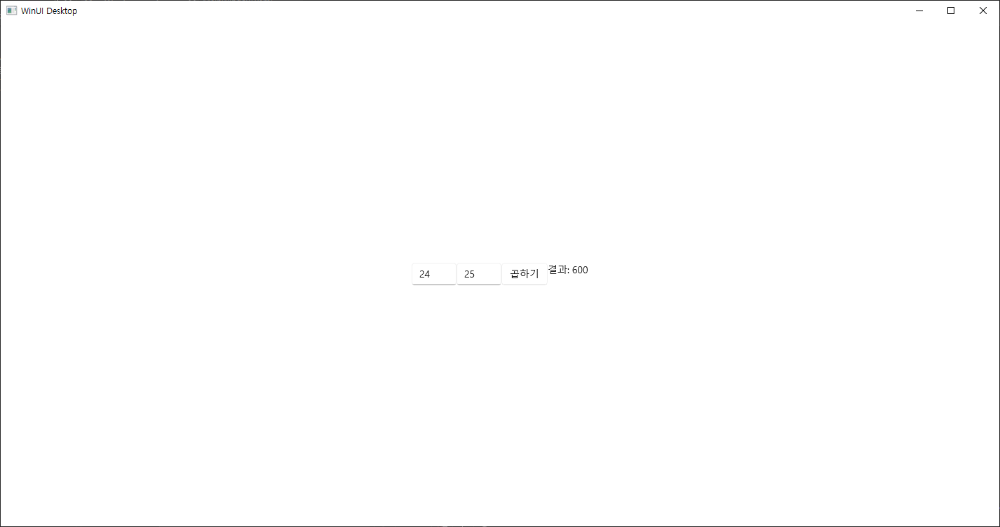

# 231114 비주얼프로그래밍 과제 </br>
20191276 양용석</br>

1. 배너 만들기</br>

```
//MainWindow.xaml.cpp
#include "pch.h"
#include "MainWindow.xaml.h"
#if __has_include("MainWindow.g.cpp")
#include "MainWindow.g.cpp"
#endif

using namespace winrt;
using namespace Microsoft::UI::Xaml;

// To learn more about WinUI, the WinUI project structure,
// and more about our project templates, see: http://aka.ms/winui-project-info.
using namespace winrt::Microsoft::Graphics::Canvas::UI::Xaml;
struct winrt::Windows::UI::Color col = winrt::Microsoft::UI::Colors::Green();
namespace winrt::App4::implementation
{
    MainWindow::MainWindow()
    {
        InitializeComponent();
        px = 200;
        py = 200;
    }

    int32_t MainWindow::MyProperty()
    {
        throw hresult_not_implemented();
    }

    void MainWindow::MyProperty(int32_t /* value */)
    {
        throw hresult_not_implemented();
    }
}
using namespace winrt::Microsoft::Graphics::Canvas::UI::Xaml;
void winrt::App4::implementation::MainWindow::CanvasControl_PointerMoved(winrt::Windows::Foundation::IInspectable const& sender, winrt::Microsoft::UI::Xaml::Input::PointerRoutedEventArgs const& e)
{
    CanvasControl canvas = sender.as<CanvasControl>();
    px = e.GetCurrentPoint(canvas).Position().X;
    py = e.GetCurrentPoint(canvas).Position().Y;
    canvas.Invalidate();
}
#include <winrt/Microsoft.Graphics.Canvas.Text.h>
using namespace winrt::Microsoft::Graphics::Canvas::Text;
float a1, a2 = 400;
void winrt::App4::implementation::MainWindow::CanvasControl_Draw(winrt::Microsoft::Graphics::Canvas::UI::Xaml::CanvasControl const& sender, winrt::Microsoft::Graphics::Canvas::UI::Xaml::CanvasDrawEventArgs const& args)
{
    CanvasTextFormat format;
    CanvasControl canvas = sender.as<CanvasControl>();
    format.HorizontalAlignment(CanvasHorizontalAlignment::Center);
    format.VerticalAlignment(CanvasVerticalAlignment::Center);
    format.FontSize(242.0f);
    //a1값이 증가함에 따라 배너가 옆으로 이동
    a1 += 5.0;
    args.DrawingSession().DrawText(L"ANU", a1, a2, winrt::Microsoft::UI::Colors::Red(), format);
    if (a1 > 1000) a1 = 0;
}
```
실행화면
</br>

2. C#을 이용한 두 수를 곱하는 프로그램</br>


```
//MainWindow.xaml
<Window
    x:Class="App10.MainWindow"
    xmlns="http://schemas.microsoft.com/winfx/2006/xaml/presentation"
    xmlns:x="http://schemas.microsoft.com/winfx/2006/xaml"
    xmlns:local="using:App10"
    xmlns:d="http://schemas.microsoft.com/expression/blend/2008"
    xmlns:mc="http://schemas.openxmlformats.org/markup-compatibility/2006"
    mc:Ignorable="d">

    <StackPanel Orientation="Horizontal" HorizontalAlignment="Center" VerticalAlignment="Center">
        <TextBox x:Name="txtNumber1" PlaceholderText="첫 번째 숫자를 입력하세요" />
        <TextBox x:Name="txtNumber2" PlaceholderText="두 번째 숫자를 입력하세요" />
        <Button x:Name="myButton" Click="myButton_Click">곱하기</Button>
        <TextBlock x:Name="txtResult" />
    </StackPanel>
</Window>
```

```
//MainWindow.xaml.cs
namespace App10
{
    /// <summary>
    /// An empty window that can be used on its own or navigated to within a Frame.
    /// </summary>
    public sealed partial class MainWindow : Window
    {
        public MainWindow()
        {
            this.InitializeComponent();
        }
        private void myButton_Click(object sender, RoutedEventArgs e)
        {
            double number1 = double.Parse(txtNumber1.Text);
            double number2 = double.Parse(txtNumber2.Text);

            double result = number1 * number2;
            txtResult.Text = $"결과: {result}";

        }
    }
}

```

실행 화면
</br>
